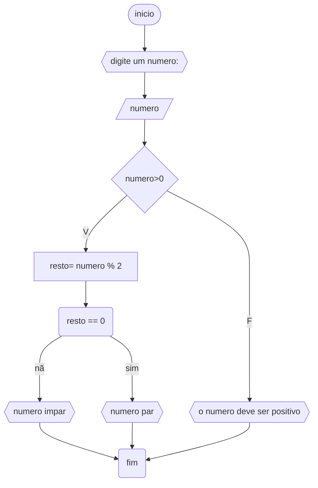
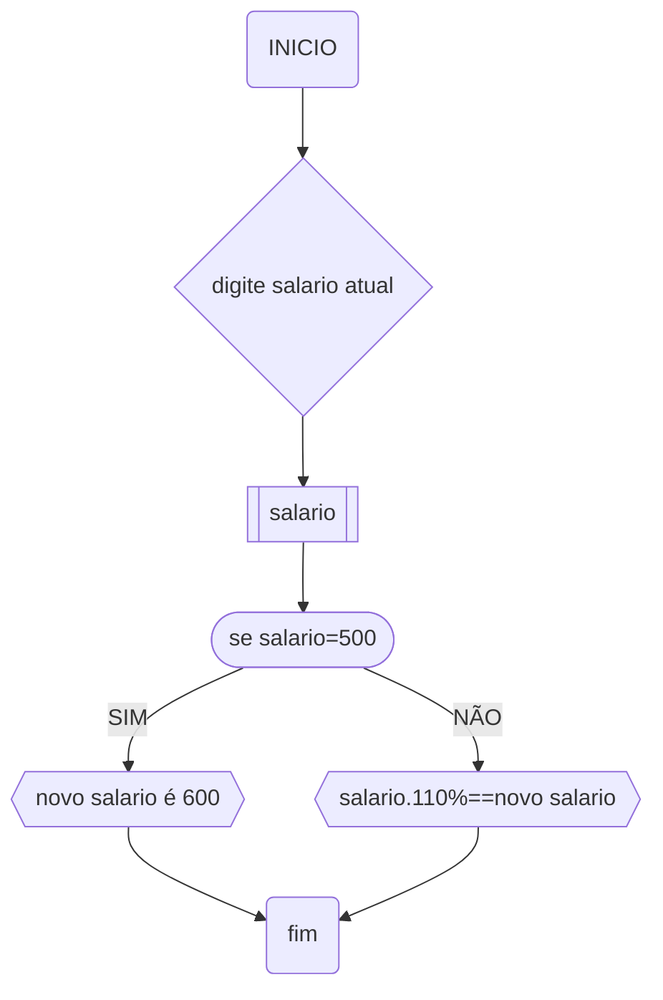

# UNIFOR
**disciplina** raciocino logico alg
**prof** prof, Ricadardo Carubi
## lista 1
### exercicio 03
Represente, em fluxograma e pseudocódigo, um algoritmo para determinar se um número
inteiro e positivo é par ou impar.

#### fluxograma



``` 
ALGORITIMO verifica_par_impar
DECLARE numero, resto INTEIRO
ESCREVA "Digite um número:"
LEIA numero
SE numero > 0 ENTAO
	resto = numero % 2
	SE resto == 0 ENTAO
		ESCREVA "O numero é par"
	SENAO
		ESCREVA "o numero é impar"
SENÃO	
	ESCREVA "O numero deve sernpositivo"
FIM                                                      
```


# TAREFA DE RLA
## Primeira questão

 ```mermaid
 graph 
 a(inicio) --> b[digite o valor da nota1:]
 b --> c[digite o valor da nota2]
c --> d((calcule: nota1+nota2==SOMA))
d --> e{se: SOMA%2<7}
	e--sim-->f[[REPROVADO]]
	e--não -->g[[APROVADO]]
f-->h(FIM)
g-->h
 ```

```
ALGORITIMO_aprovado_ou_reprovado
DECLARE nota1, nota2, soma, media
ESCREVA "digite uma nota"
LEIA nota1
ESCREVA "digite a outra nota"
LEIA nota2
CALCULE nota1+nota2
LEIA soma
CALCULE soma%2
LEIA media
SE media<7 
	ENTAO 
	 ESCREVA "APROVADO"
	SENAO 
	 ESCREVA "REPROVADO"
FIM
```


# TAREFA RLA
## SEGUNDA QUESTÃO
novo salario



ALGORITIMO novo_salario
DECLARE salario, novo salario
ESCREVA "digite seu salario:"
LEIA salario 
SE salario=500
	ENTÃO
		ESCREVA "novo salario é 600"
	SENÃO
		CAlCULE "salario".110%
		LEIA "novo salario"
		ESCREVA "novo salario é "novo salario""
FIM
```


# QUESTÃO 4
## idade e cnh

```mermaid
graph
a(INICIO)-->b[(digite sua idade:)]
b-->c[[idade]] 
c-->d([idade<18])
d--NÃO-->e{{CNH já pode ser reitirada}}
d--SIM--
```ALGORITIMO_CNHDEClARE idadeESCREVA "digite sua idade:"LEIA idadeSE idade<18	ENTÃO		ESCREVA "faltam (18-idade) anos para poder retirar sua CNH	SENÃO		ESCREVA "CNH já pode ser retirada"FIM``` >f{{FALTAM 18-idade anos para poder retirar sua CNH}}
e-->FIM
f-->FIM
```

```
ALGORITIMO_CNH
DEClARE idade
ESCREVA "digite sua idade:"
LEIA idade
SE idade<18
	ENTÃO
		ESCREVA "faltam (18-idade) anos para poder retirar sua CNH
	SENÃO
		ESCREVA "CNH já pode ser retirada"
FIM
```


